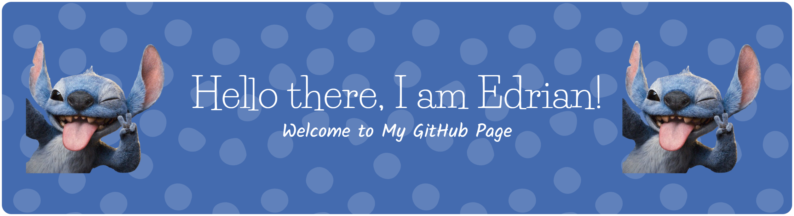
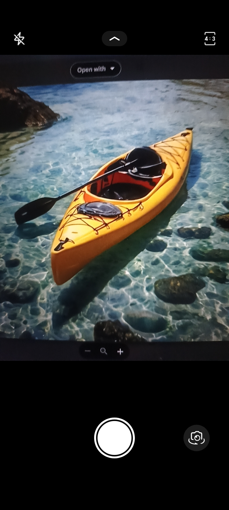
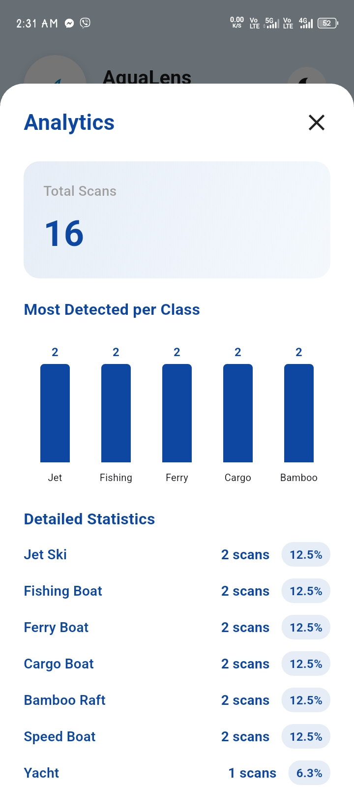
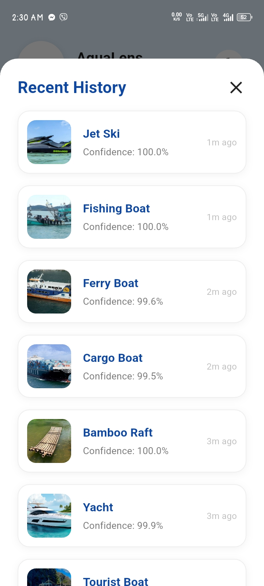

✨ **Information Technology Student | Exploring web & building cool stuff**

📍 Currently studying at **Caraga State University Cabadbaran Campus**

---

## 💻 About Me
I'm passionate about coding, open source, and learning new technologies.

- 🔭 I’m currently working on: **Web Development**
- 🌱 I’m learning: **Mobile Development**
- 🏐 Aside from coding, I love playing **volleyball**
- 🎧 Listening to music helps me stay productive

---

## 🛠️ Languages and Tools I've Learned

### 🌐 Web Development

### 🧠 Programming Languages

### 📱 Mobile Development

### ⚙️ Tools & Environment

---

## 📊 GitHub Activity

<table>
  <tr>
    <td align="center">
      
    </td>
    <td align="center">
      
    </td>
  </tr>
</table>

---

## 🚀 Current Project: AquaLens (Flutter App)

This project is a mobile application called **AquaLens**, developed using **Flutter** as part of my coursework in Information Technology. AquaLens is a boat classification app that helps users identify different types of boats using a trained image recognition model. The app can analyze boats either by **taking a photo with the camera** or by **uploading an existing image**, making it flexible to use in real situations.

AquaLens focuses on a specific set of boat classes that are available in the built-in dictionary. After running a scan, the app shows the predicted class together with **confidence percentages**, as well as analytics such as detections per class and a history of past scans. Overall, this project allowed me to practice Flutter UI design, basic machine learning integration for image classification, and organizing app features into a clear and user-friendly interface.

---

### 🛥️ Boat Classes Overview

Below is a quick overview of the boat classes that AquaLens can recognize, with a short description and a sample image for each class.

| Class Name | Description | Sample Image |
| :--- | :--- | :---: |
| **Bamboo Raft** | A flat structure made of bamboo logs tied together, often used for transport in shallow waters. |  |
| **Cargo Boat** | A large vessel designed to carry heavy goods and materials across oceans. |  |
| **Ferry Boat** | A boat used to transport passengers and vehicles across a body of water on a regular schedule. |  |
| **Fishing Boat** | A boat used to catch fish in the sea, or on a lake or river. |  |
| **Jet Ski** | A small, fast recreational watercraft that the rider sits or stands on. |  |
| **Kayak** | A narrow watercraft propelled by a double-bladed paddle. |  |
| **Sail Boat** | A boat propelled partly or entirely by sails. |  |
| **Speed Boat** | A motorboat designed for high speed. |  |
| **Tourist Boat** | A boat used for sightseeing and transporting tourists. |  |
| **Yacht** | A medium-sized sailing boat equipped for cruising or racing. |  |

---

### 🏠 Main Page & 📖 Boat Dictionary

| Main Page | Boat Dictionary |
| :---: | :---: |
|  |  |

The **Main Page** serves as the hub for the app, allowing users to navigate to the dictionary, open the camera or upload screen, and access other features of AquaLens. The **Boat Dictionary** lists all the boat species included in the model, helping users know which boats they can scan with the app. Each entry represents a class that users can scan and learn about.

---

### 📷 Capture or Upload Images & ✅ Scan Result

| Capture or Upload Images | Scan Result |
| :---: | :---: |
|  |  |

Users can either take a new picture of a boat using the camera or choose an existing photo from their gallery as input for classification. The **Scan Result** screen displays the predicted class along with confidence values, helping users understand how certain the model is about its prediction.

---

### 📈 Analytics, Detections per Class & 🕒 Scan History

| Analytics & Detections per Class | Scan History |
| :---: | :---: |
|  |  |

The **Analytics** screen summarizes how the app is being used, including how many detections each boat class has. The Detections per Class chart visualizes how often each type of boat has been scanned. The **History** page keeps a record of past scans, including the detected class, accuracy, and time. This lets users review previous results and track their usage of AquaLens.

---

### 🚀 Key Features Summary

| Feature | Description |
| :--- | :--- |
| **Image Capture & Upload** | Users can either take a new picture of a boat using the camera or choose an existing photo from their gallery as input for classification. |
| **Boat Class Recognition** | The app runs an image classification model to predict which boat class the sample belongs to, based on the supported types in the built-in dictionary. |
| **Confidence-Based Results** | Each scan displays confidence values for the detected class, helping users understand how certain the model is about its prediction. |
| **Interactive Boat Dictionary** | A reference section where users can browse the available boat classes, view their images, and read short descriptions before or after scanning. |
| **Usage Analytics** | Analytics and detections-per-class charts provide an overview of which boats are scanned the most and how the model has been used over time. |

---

## 💬 Quote of the Day

> “Programming is similar to a game of golf. The point is not getting the ball in the hole but how many strokes it takes.”
> — *Harlan Mills*

Thanks for visiting! Feel free to check out my repos and connect! ✨
