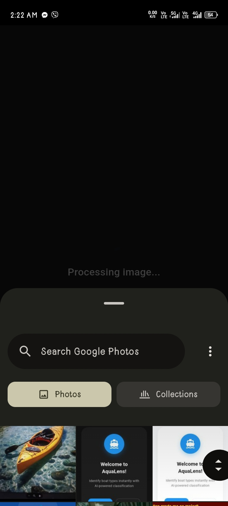

✨ **Information Technology Student | Exploring web & building cool stuff**

📍 Currently studying at **Caraga State University Cabadbaran Campus**

---

## 💻 About Me
I'm passionate about coding, open source, and learning new technologies.

- 🔭 I’m currently working on: **Web Development**
- 🌱 I’m learning: **Mobile Development**
- 🏐 Aside from coding, I love playing **volleyball**
- 🎧 Listening to music helps me stay productive

---

## 🛠️ Languages and Tools I've Learned

### 🌐 Web Development

### 🧠 Programming Languages

### 📱 Mobile Development

### ⚙️ Tools & Environment

---

## 📊 GitHub Activity

<table>
  <tr>
    <td align="center">
      
    </td>
    <td align="center">
      
    </td>
  </tr>
</table>

---

## 🚀 Current Project: AquaLens (Flutter App)

This project is a mobile application called **AquaLens**, developed using **Flutter** as part of my coursework in Information Technology. AquaLens is a boat classification app that helps users identify different types of boats using a trained image recognition model. The app can analyze boats either by **taking a photo with the camera** or by **uploading an existing image**, making it flexible to use in real situations.

AquaLens focuses on a specific set of boat classes that are available in the built-in dictionary. After running a scan, the app shows the predicted class together with **confidence percentages**, as well as analytics such as detections per class and a history of past scans. Overall, this project allowed me to practice Flutter UI design, basic machine learning integration for image classification, and organizing app features into a clear and user-friendly interface.

---

### 🛥️ Boat Classes Overview

Below is a quick overview of the boat classes that AquaLens can recognize, with a short description and a sample image for each class.

| Class Name | Description | Sample Image |
| :--- | :--- | :---: |
| **Bamboo Raft** | A flat structure made of bamboo logs tied together, often used for transport in shallow waters. |  |
| **Cargo Boat** | A large vessel designed to carry heavy goods and materials across oceans. |  |
| **Ferry Boat** | A boat used to transport passengers and vehicles across a body of water on a regular schedule. |  |
| **Fishing Boat** | A boat used to catch fish in the sea, or on a lake or river. |  |
| **Jet Ski** | A small, fast recreational watercraft that the rider sits or stands on. |  |
| **Kayak** | A narrow watercraft propelled by a double-bladed paddle. |  |
| **Sail Boat** | A boat propelled partly or entirely by sails. |  |
| **Speed Boat** | A motorboat designed for high speed. |  |
| **Tourist Boat** | A boat used for sightseeing and transporting tourists. |  |
| **Yacht** | A medium-sized sailing boat equipped for cruising or racing. |  |

---

### 🏠App Overview

| Inro Screen | Main Page | Night Mode | App Information |
| :---: | :---: | :---: | :---: |
|  |  |  |  |

The **Intro Screen** welcomes users with a clean interface, leading to the **Main Page** which serves as the central hub for accessing the camera, gallery, and other features. The app includes a sleek **Night Mode** for comfortable usage in low-light environments, while the **App Information** section provides details about AquaLens and lists all supported boat classifications for easy reference.

---

### 📷 Capture or Upload Images & ✅ Scan Result

| Capture Image | Upload Images | Scan Result | 
| :---: | :---: | :---: |
|  |  |  |

Users can seamlessly **Capture** a photo in real-time or **Upload** an existing image from their gallery for instant classification. The **Scan Result** screen presents the identified boat class with a high-precision **Confidence Score** and **Rating**, accompanied by a **Probability Distribution** breakdown to visualize the model's prediction accuracy.

---

### Analysis Results, 🕒 Scan History, 📈 Analytics, & Detections per Class

| Analysis Results | Scan History | Analytics & Detections per Class |
| :---: | :---: | :---: |
|  |  |  |

The **Analysis Results** provide a deep dive into each scan, offering typical usage details and descriptions for the identified boat. The **Scan History** keeps a chronological record of all past identifications, allowing users to revisit previous results. The **Analytics** dashboard visualizes usage trends, displaying total scan counts and a **Most Detected per Class** bar chart to track which boat types are encountered most frequently.

---

### 🚀 Key Features Summary

| Feature | Description |
| :--- | :--- |
| **Image Capture & Upload** | Users can either take a new picture of a boat using the camera or choose an existing photo from their gallery as input for classification. |
| **Boat Class Recognition** | The app runs an image classification model to predict which boat class the sample belongs to, based on the supported types in the built-in dictionary. |
| **Confidence-Based Results** | Each scan displays confidence values for the detected class, helping users understand how certain the model is about its prediction. |
| **Interactive Boat Dictionary** | A reference section where users can browse the available boat classes, view their images, and read short descriptions before or after scanning. |
| **Usage Analytics** | Analytics and detections-per-class charts provide an overview of which boats are scanned the most and how the model has been used over time. |

---

## 🤝 Connect with Me

---

## 💬 Quote of the Day

> “Programming is similar to a game of golf. The point is not getting the ball in the hole but how many strokes it takes.”
> — *Harlan Mills*

Thanks for visiting! Feel free to check out my repos and connect! ✨
